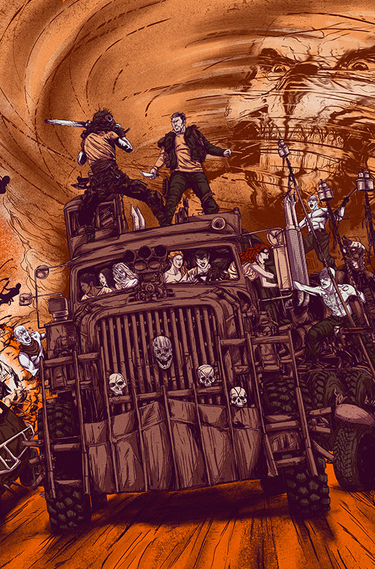

#BUS FIGHTING SIMULATOR

"In a ravaged post-apocalyptic world, two ruthless gangs fiercely battle for dominance over the territory, aboard heavily armed buses. Resources are scarce, and survival depends on their strength and determination. Welcome to "Bus Fighting Simulator".

### Built With

This section should list any major frameworks/libraries used to bootstrap your project. Leave any add-ons/plugins for the acknowledgements section. Here are a few examples.

       

